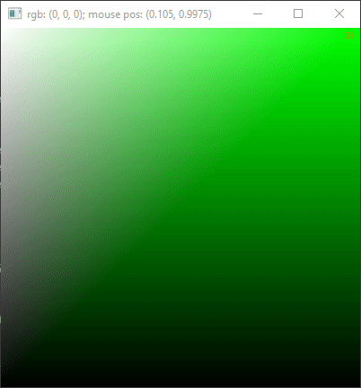

Just a quick and super simple color-picker, like you can find in image editors.

Uses SFML. Color is hard-coded in the source.
The currently "picked" color (as in under the mouse cursor) is shown in the window's title bar.

